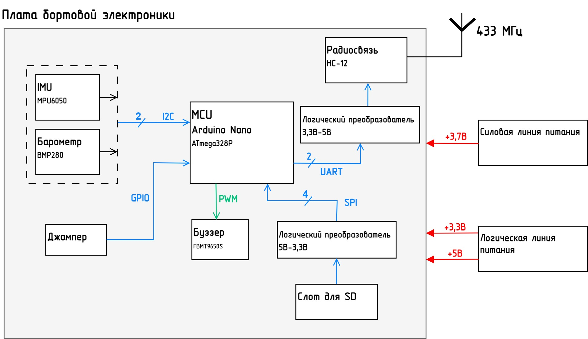
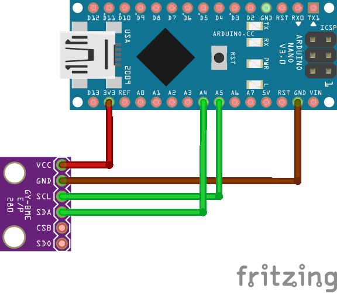
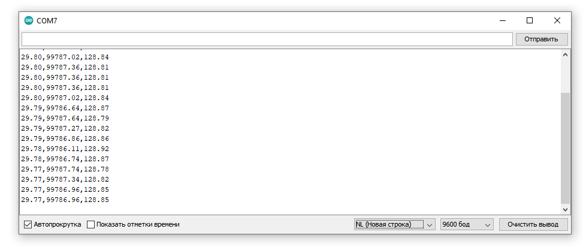
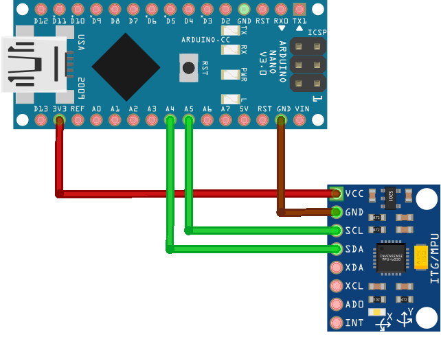
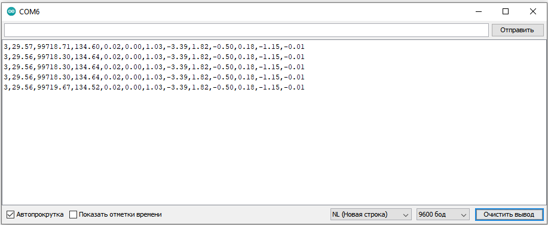
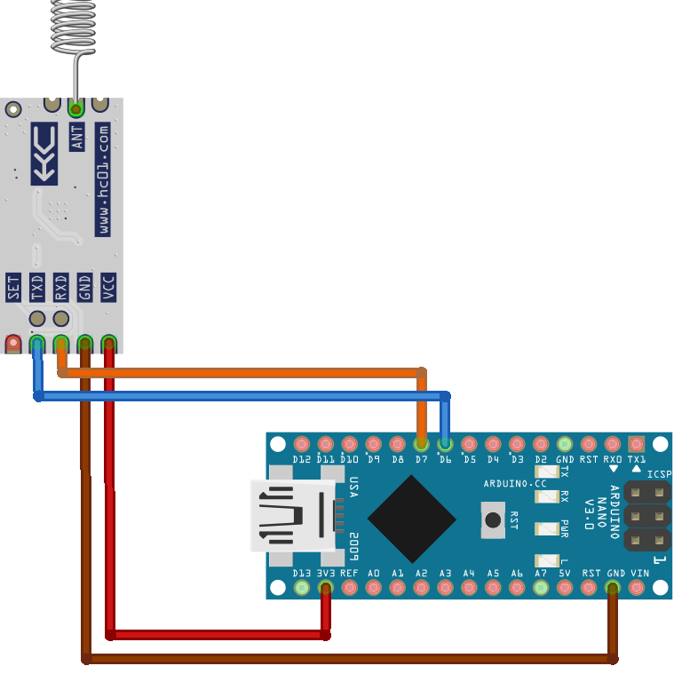
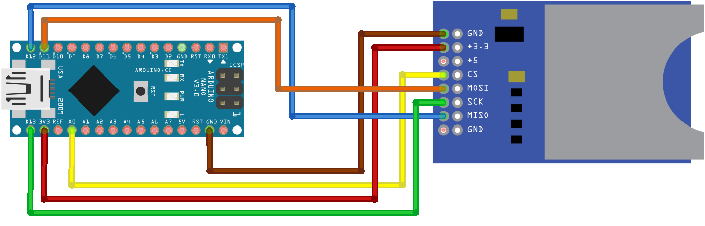
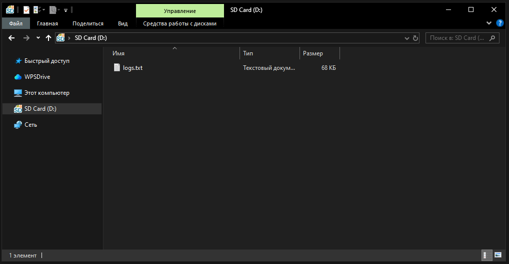
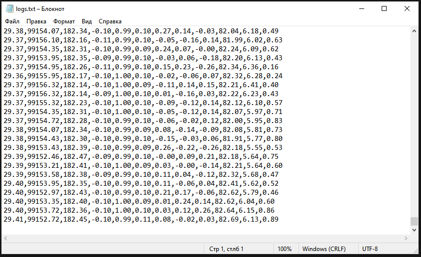
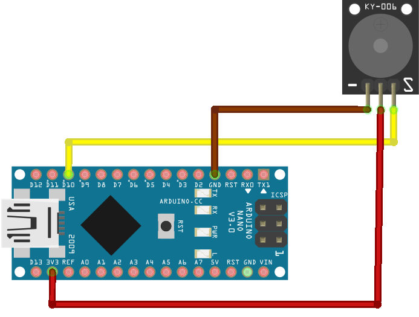

# Написание программного кода для бортовой электроники ЭМР или CanSat-a на Arduino.

<!--Перед началом, убедитесь, что у вас уже установлены:
- **ArduinoIDE** (Последняя версия с [официального сайта](https://www.arduino.cc/en/software/). В случае проблем с последней версией, используйте legacy-версию);
- **[ERMTelemetry](https://github.com/danielmamyashev/ERMTelemetry)** - для наглядной визуализации данных пакетов телеметрии.

Скачайте недостающее, и можно начинать.

---
-->

## Содержание
1. Структура программы в Arduino IDE;
2. Подключение барометра BMP280;
3. Подключение инерциального датчика MPU6050;
4. Использование радиомодуля HC-12<!-- : отправка данных по радио, парсинг пакетов телеметрии -->;
5. Запись телеметрии на SD-карту;
6. Использование буззера;
7. Написание алгоритма.
    - Создание конечного автомата (state machine);
    - Использование таймеров;
    - Реализация джампера (для ЭМР);
    - Деинициализация датчиков.

---



# 1 Структура программы в Arduino IDE

При первом запуске Arduino IDE вы можете видеть стандартный шаблон (заготовку программы):

```c++
void setup() {
  // put your setup code here, to run once:

}

void loop() {
  // put your main code here, to run repeatedly:

}
```

Структура программы в Arduino состоит из двух основных функций:
- **setup()** - Выполняется один раз при включении или перезагрузке микроконтроллера. Здесь инициализируются датчики, задаются начальные значения переменных и тд.

- **loop()** - Функция основного цикла. Сюда пишут код, который должен выполняться постоянно и циклически: опрос датчиков, обработка данных, отправка телеметрии и тд. Данный цикл является бесконечным.

# 2 Подключение барометра BMP280

Схема подключения:



> Датчик BMP280 измеряет температуру и давление. А по барометрической формуле мы можем вычислить высоту.

Для чтения данных с барометра используем библиотеку [GyverBME280](https://github.com/GyverLibs/GyverBME280).

Скачайте репозиторий [GyverBME280](https://github.com/GyverLibs/GyverBME280) в виде ZIP-архива (кнопка Code > Download ZIP).

Добавим библиотеку в IDE:
- На панели инструментов: **Скетч > Подключить библиотеку > Добавить .ZIP библиотеку...**.
- В появившемся окне выберите скачанный архив.

Подключим ее к текущему скетчу:
- На панели инструментов: **Скетч > Подключить библиотеку > GyverBME280**.

---

Сверху появится строчка с подключением библиотеки:

```c++
#include <GyverBME280.h>
```
---

Создадим **объект** — специальную переменную, через которую мы будем управлять датчиком. Для этого напишем сразу после строчки с подключением библиотеки:
```c++
GyverBME280 bmp;
```

Объявим 3 переменные типа float:
```c++
float temp, pres, altitude;
```

Пропишем инициализацию барометра в функции setup():
```c++
void setup() {
  bmp.begin();
}
```

- Для чтения температуры библиотека использует функцию: ```readTemperature()```
- Для чтения давления: ```readPressure()```
- Для вычисления высоты по барометрической формуле: ```pressureToAltitude()```

Напишем в главном цикле:
```c++
void loop() {
   temp = bmp.readTemperature(); //Запись в переменную temp значения температуры
   pres = bmp.readPressure(); //Запись в переменную pres значения давления
   altitude = pressureToAltitude(pres); //Запись в переменную altitude вычисляемой высоты

   delay(1000); //Задержка в миллисекундах
}
```

---

Для того, чтобы выводить данные используем **последовательный порт** (**serial port**, **COM-порт**).

Добавим в секцию setup() запуск последовательного порта на скороcти 9600 бит в секунду:
```c++
void setup() {
  Serial.begin(9600);

  bmp.begin();
}
```
Барометр BMP280 и инерциальный датчик MPU6050 находятся на шине I2C. Для того, чтобы ее активировать в setup() прописывается:
```c++
Wire.begin();
```

Для вывода значений каких либо переменных или текстового сообщения в последовательный порт можно использовать:
```c++
Serial.print("Переменная");
```

Для этого изменим главный цикл следующим образом:
```c++
void loop() {
   temp = bmp.readTemperature(); //Запись в переменную temp значения температуры
   pres = bmp.readPressure(); //Запись в переменную press значения давления
   altitude = pressureToAltitude(pres); //Запись в переменную altitude вычисляемой высоты

   Serial.print(temp); //Вывод в serial port значения temp
   Serial.print(",");
   Serial.print(pres); //Вывод в serial port значения temp
   Serial.print(",");
   Serial.print(altitude); //Вывод в serial port значения temp
   Serial.print(",");
   Serial.println(); // Переход на следующую строчку

   delay(1000); //Задержка в миллисекундах
}
```

---

- Сверху на панели инструментов нажмите на кнопку **"проверить" (галочка)**;
- После того как проект успешно скомпилировался, нажмите на кнопку **"Загрузка" (стрелочка)**.

Для того, чтобы видеть сообщения отправляемые в serial port откройте **монитор порта**:
- **Инструменты > Монитор порта**



# 3 Подключение инерциального датчика MPU6050

Схема подключения:



Для MPU6050 аналогично библиотеке BMP280 скачайте и добавте в скетч библиотеку [mpu6050](https://github.com/tockn/MPU6050_tockn).
> MPU6050 измеряет линейные ускорения и угловые скорости. Библиотека использует комплементарный фильтр, который используя данные акселерометра и гироскопа вычисляет ориентацию.

При использовании данной библиотеки объект создается следующим образом:
```c++
MPU6050 mpu(Wire);
```

Создадим переменные:
```c++
float ax, ay, az; //Линейные ускорения
float gx, gy, gz; //Угловые скорости
float roll, pitch, yaw; //Углы
```

Пропишим инициализацию датчика, а также калибровку:
```c++
mpu.begin(); //Инициализация MPU6050

mpu.calcGyroOffsets(); //Калибровка MPU6050
```

В главный цикл добавим:
```c++
mpu.update(); // Обновление данных MPU6050

ax = mpu.getAccX();
ay = mpu.getAccY();
az = mpu.getAccZ();

gx = mpu.getGyroX();
gy = mpu.getGyroY();
gz = mpu.getGyroZ();

roll  = mpu.getAngleX();
pitch = mpu.getAngleY();
yaw   = mpu.getAngleZ();
```

И сделаем вывод значений новых переменных в последовательный порт:
```c++
Serial.print(ax);
Serial.print(",");
Serial.print(ay);
Serial.print(",");
Serial.print(az);
Serial.print(",");
Serial.print(gx);
Serial.print(",");
Serial.print(gy);
Serial.print(",");
Serial.print(gz);
Serial.print(",");
Serial.print(roll);
Serial.print(",");
Serial.print(pitch);
Serial.print(",");
Serial.print(yaw);
Serial.println();
```

Проверьте вывод данных bmp280 и mpu6050:



# 4 Использование радиомодуля HC-12<!--: отправка данных по радио, парсинг пакетов телеметрии-->

Схема подключения:



Для работы радиомодуля используется протокол UART. Однако аппаратный UART также задействован для прошивки Arduino Nano по USB. Для того, чтобы избежать конфликта, создадим отдельный программный UART, подключив радиомодуль к пинам D6 и D7. 

Для этого подключим библиотеку SoftwareSerial для создания программного последовательного порта:
```C++
#include <SoftwareSerial.h>
```

Сразу после с объявлением объектов bmp и mpu напишем:
```c++
SoftwareSerial HC12(6, 7); //Создание программного UART на пинах D6 и D7
```

В setup() пропишем запуск виртального UART:
```C++
HC12.begin(9600); 
```

Если для отправки данных COM-порту мы использовали``` Serial.print(...) ```, для отправки данных по **виртуальному** COM-порту используем:
```C++
HC12.print(...)
```

# 5 Запись телеметрии на SD-карту

Схема подключения:


Подключим необходимые библиотеки:
```c++
#include <SD.h>
#include <SPI.h>
```

Объявим объект для работы с файлом:
```c++
File file;
```

Пропишем в setup() инициализацию sd-карты:
```c++
if (SD.begin(A1))
{
  Serial.println("с SD все ок");
}
else
{
  Serial.println("ошибка SD");
}
```

Для записи данных на sd-карту напишем в главном цикле:
```c++
file = SD.open("logs.txt", FILE_WRITE); 

  if (file) {
    file.print(ax);
    file.print(",");
    file.print(ay);
    file.print(",");
    file.print(az);
    file.print(",");
    file.print(gx);
    file.print(",");
    file.print(gy);
    file.print(",");
    file.print(gz);
    file.print(",");
    file.print(roll);
    file.print(",");
    file.print(pitch);
    file.print(",");
    file.print(yaw);
    file.println();

    file.close();
  }
```

---

На sd-карте появился .txt файл с записанными логами:



Проверим его содержимое:



# 6 Использование буззера

Схема подключения:



Объявим макроопределение для цифрового пина буззера, через который будем управлять сигналом (добавляется рядом с объявлением переменных перед setup()):
```c++
#define BUZZER_PIN 3
```

Чтобы управлять звуковым сигналом буззера используем следующие функции:
```c++
tone(BUZZER_PIN, 1000); //Включение буззера (Частота - 1000 Гц)
delay(500);
noTone(BUZZER_PIN);  //Выключение буззера
```
Меняя частоту, можно создавать мелодии.

# 7 Написание алгоритма
## Создание конечного автомата (state machine)

> ***Конечный автомат (state machine)*** - это набор состояний (ожидание, старт, полёт, апогей, спуск, посадка) и правил перехода между ними.

Для реализации конечного автомата используем конструкцию switch case:
```C++
switch (stage) {
  case 0:
    if (условие_перехода) {

      //Выполнение действий на этапе 0

      stage = 1; //Переход к следующему этапу полета
    }
    break;
  case 1:  
    if (условие_перехода) {

      //Выполнение действий на этапе 1

      stage = 2; //Переход к следующему этапу полета
    }
    break;
  case 2:  
    // и т.д. ... 
    break;
}
```
---

## Использование таймеров

Для отсчёта интервалов без остановки программы в arduino используется функция **```millis()```**. Она возвращает количество миллисекунд с момента запуска микроконтроллера.

Если функция ```delay()``` полностью блокирует весь код, т.е. останавливает опрос датчиков, запись пакетов телеметрии на и т.д., ```millis()``` позволяет узнавать, сколько прошло времени, продолжая при этом читать датчики и отправлять телеметрию.

Для этого:
```C++
unsigned long start_time = millis(); // Записываем в переменную время, прошедшее с момента запуска мк.

//Потом, когда нам потребуется просто:

//текущее_время - время_в_переменной = прошеднее_время

//И все
```

---

## Реализация джампера (для ЭМР)

> **СПРАВОЧНАЯ ИНФОРМАЦИЯ**: ***Джампер*** - электрическая перемычка, замыкающая контакты. Когда ракета стартует, перемычка размыкается, что помогает зафиксировать момент старта.

Для того, чтобы прочитать состояние пина, в начале кода объявим макроопределение для пина джампера:
```C++
#define JUMPER_PIN 9
```

Создадим переменную: 
```C++
bool is_jumper_connected;
```

В setup() настроим пин на вход с подтяжкой к питанию:
```C++
pinMode(JUMPER_PIN, INPUT_PULLUP);
```

Проверим, замкнут ли джампер:
```C++
is_jumper_connected = (digitalRead(JUMPER_PIN) == 0);
// 0 - джампер замкнут на землю
// 1 - джампер разомкнут
```
## Деинициализация датчиков

После приземления аппарата, с целью экономии заряда батареи, имеет смысл деинициализировать датчики, что больше нам не нужны. Однако, так как в используемых библиотеках на bmp280 и mpu6050 отсутствуют готовые методы для деинициализации, можно просто перестать их опрашивать и отключить саму линию I2C. Для данного проекта, этого будет более чем достаточно. Отключить линию I2C можно следующим образом:
```C++
Wire.end();
```

# Задание

**Написать программный код бортовой электроники в соответствии с выбранным профилем.**

## Условия
- Необходимо осуществлять передачу полетной телеметрии, включающей в себя:
    * id команды (номер группы + номер команды. Например, группа 1115, команда №2 => id=152);
    * Значение давления;
    * Значение температуры;
    * Высоту полета над уровнем моря;
    * Значения акселерометра по трем осям (линейные ускорения);
    * Значения гироскопа по трем осям (угловые скорости);
    * Углы ориентации ракеты по трем осям (для этого требуется найти необходимые методы в библиотеке);
    * Флаг текущего этапа полета.
- Необходимо производить запить данных полетной телеметрии на энергонезависимую память (sd-карта);
- Переходы между этапами полета в конечном автомате должны содержать более одного условия.
